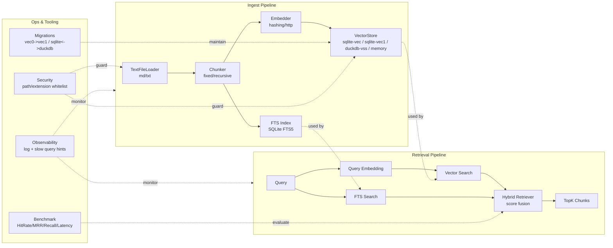

# YFanRAG

面向个人开发者与小团队的本地优先 RAG 工具库，提供文档加载、分块、向量化、检索、融合、评测与迁移能力。  
无需独立向量数据库，直接基于 SQLite / DuckDB 运行。

## 功能概览

- 多后端向量存储：`sqlite-vec`、`sqlite-vec1`、`duckdb-vss`、`memory`
- 检索模式：`auto` 自适应路由、向量检索、FTS 检索、混合检索（向量 + FTS）
- 数据维护：增量更新、按 `doc_id` 删除、跨后端迁移
- 查询增强：字段过滤、范围过滤、Multi-Query 扩展、RRF 融合、批处理与 embedding 缓存
- 工程能力：Benchmark 报告、统一日志、慢查询提示、安全白名单

## 架构图



## 快速开始

### 1) 安装

```powershell
python -m venv .venv
.\.venv\Scripts\Activate.ps1
pip install -e .[dev]
```

可选依赖：

```powershell
pip install -e .[sqlite]   # sqlite-vec
pip install -e .[duckdb]   # duckdb-vss
```

### 2) 入库

```powershell
yfanrag ingest docs/ --db yfanrag.db --store sqlite-vec --enable-fts
```

可选后端：

```powershell
yfanrag ingest docs/ --db yfanrag.db --store sqlite-vec1
yfanrag ingest docs/ --db yfanrag.duckdb --store duckdb-vss --vss-persistent-index
```

### 3) 检索

向量检索：

```powershell
yfanrag query "hello" --db yfanrag.db --store sqlite-vec --top-k 3
```

全文检索：

```powershell
yfanrag fts-query "hello" --db yfanrag.db --top-k 3
```

混合检索：

```powershell
yfanrag hybrid-query "hello" --db yfanrag.db --store sqlite-vec1 --top-k 3 --alpha 0.5
```

## 常用 CLI 能力

| 命令 | 作用 | 示例 |
| --- | --- | --- |
| `ingest` | 文档分块、向量化并入库（支持增量 upsert） | `yfanrag ingest docs/ --db yfanrag.db --store sqlite-vec1` |
| `query` | 向量检索 | `yfanrag query "vector store" --db yfanrag.db --store duckdb-vss` |
| `fts-query` | SQLite FTS5 检索 | `yfanrag fts-query "sqlite" --db yfanrag.db` |
| `hybrid-query` | 向量 + FTS 融合检索 | `yfanrag hybrid-query "sqlite" --db yfanrag.db --alpha 0.6` |
| `delete` | 按 `doc_id` 删除向量与可选 FTS 索引 | `yfanrag delete --db yfanrag.db --doc-id "file:docs/TECHNICAL.md" --enable-fts` |
| `benchmark` | 生成检索质量与性能报告 | `yfanrag benchmark benchmarks/cases.jsonl --db yfanrag.db --mode hybrid --output report.json` |
| `migrate-vec0-to-vec1` | 将 `sqlite-vec(vec0)` 表迁移到 `vec1` 适配层 | `yfanrag migrate-vec0-to-vec1 --db yfanrag.db` |
| `migrate-sqlite-duckdb` | SQLite(vec1) 与 DuckDB(vss) 双向迁移 | `yfanrag migrate-sqlite-duckdb --direction sqlite-to-duckdb` |
| `chat-ui` | 启动 Tkinter 对话界面（接入真实大模型 API） | `yfanrag chat-ui` |

## 查询过滤

字段过滤：

```powershell
yfanrag query "hello" --db yfanrag.db --store sqlite-vec1 --filter "doc_id=file:docs/TECHNICAL.md"
```

范围过滤：

```powershell
yfanrag query "hello" --db yfanrag.db --store sqlite-vec1 --range "start:0:2000" --range "index:0:10"
```

## 批处理与缓存

`ingest` 支持 embedding 批处理和缓存控制：

```powershell
yfanrag ingest docs/ --db yfanrag.db --store sqlite-vec --embed-batch-size 128
yfanrag ingest docs/ --db yfanrag.db --store sqlite-vec --disable-embed-cache
```

## Benchmark 评测

支持 `json` / `jsonl` 数据集，按用例统计：

- `hit_rate`
- `mrr`
- `recall`
- `latency_ms`（`avg/p50/p95/max`）

`cases.jsonl` 每行示例：

```json
{"query":"hello","expected_doc_ids":["file:docs/TECHNICAL.md"]}
```

## 迁移与兼容

vec0 -> vec1：

```powershell
yfanrag migrate-vec0-to-vec1 --db yfanrag.db --source-table vec_chunks
```

SQLite(vec1) <-> DuckDB(vss)：

```powershell
yfanrag migrate-sqlite-duckdb --direction sqlite-to-duckdb --sqlite-db yfanrag.db --duckdb-db yfanrag.duckdb
yfanrag migrate-sqlite-duckdb --direction duckdb-to-sqlite --duckdb-db yfanrag.duckdb --sqlite-db yfanrag.db
```

## 可观测性

全局日志与慢查询阈值：

```powershell
yfanrag --log-level INFO --slow-query-ms 50 query "hello" --db yfanrag.db --store sqlite-vec1
```

也可使用环境变量：

- `YFANRAG_LOG_LEVEL`
- `YFANRAG_SLOW_QUERY_MS`

## 安全与隔离

限制可读路径（防止越权读取）：

```powershell
yfanrag ingest docs/ --path-whitelist "D:\Documents\GitHub\YFanRAG\docs"
```

限制扩展加载路径（防止任意扩展注入）：

```powershell
yfanrag query "hello" --store sqlite-vec1 --sqlite-extension-path "D:\ext\vec1.dll" --extension-whitelist "D:\ext"
```

也可使用环境变量：

- `YFANRAG_PATH_WHITELIST`
- `YFANRAG_EXTENSION_WHITELIST`

## 示例

参见 [examples/README.md](examples/README.md)（含 3 个可运行示例）：

- `examples/01_basic_ingest_query.py`
- `examples/02_hybrid_query.py`
- `examples/03_benchmark.py`
- `examples/04_tk_chat_app.py`

## Tkinter 对话应用（图形化页面）

### 启动方式

```powershell
yfanrag chat-ui
```

或：

```powershell
python examples/04_tk_chat_app.py
```

### 支持的 Provider 格式

- `openai_compatible`（`/v1/chat/completions` 及兼容供应商）
- `deepseek`（`https://api.deepseek.com/chat/completions`，OpenAI-Compatible）
- `openai_responses`（`/v1/responses`）
- `anthropic`（`/v1/messages`）

### 页面结构

- 顶栏：`Knowledge Base` 按钮、`Stream` 开关、状态指示（Ready/Request in flight/Stopped）。
- 左侧配置栏：`provider / endpoint / model / api_key / header / system prompt / extra headers / extra body`。
- 右侧会话区：对话记录（支持 Markdown 渲染：标题、列表、粗体/斜体、代码块等）、消息输入框、`Send`、`Stop`。

### 快速上手（对话）

1. 选择 Provider 预设（建议先用 `OpenAI-Compatible` 或 `DeepSeek`）。
2. 填写 `Endpoint / Model / API Key`。
3. 在右下输入框输入问题，按 `Ctrl+Enter` 或点击 `Send`。
4. 需要流式输出时打开 `Stream`，中断生成点击 `Stop`。

### API 配置本地持久化（加密）

- 启动时自动读取本地加密配置（若存在）。
- 退出窗口时自动保存当前 API 配置（加密后写盘）。
- 可手动点击 `Save API Config` 和 `Reload API Config`。
- 默认文件路径：`~/.yfanrag/chat_api_config.enc.json`。

### 知识库管理窗口用法

点击顶栏 `Knowledge Base` 打开管理窗口，按下面流程操作：

1. 选择 `Database` 文件、`Store`（推荐 `sqlite-vec1`）、`Chunker`、`Chunk Size/Overlap`、`Embedding Dims`。
2. 点击 `Add Files` 或 `Add Folder` 选择文本/代码文件（如 `.md/.txt/.py/.gd/.js` 等），然后点 `Ingest / Upsert` 入库。
3. 用 `Refresh Stats` 查看当前 `docs/chunks` 统计，用 `List Doc IDs` 查看可删除文档 ID。
4. 在 `KB Query` 输入检索词并 `Run Query` 预览召回结果（支持 `auto / vector / hybrid / fts`；查询会先扩展为 3-5 个子查询，再做 RRF 融合）。
5. 在 `Delete Doc ID(s)` 输入一个或多个 `doc_id`（空格/逗号分隔）并点击 `Delete`。

### 自适应检索路由（`auto`）

- GUI 默认 `Query Mode = auto`。
- `auto` 会根据查询特征自动选择：
  - 关键词/路径/报错定位倾向：优先 `fts`
  - 语义问答倾向：优先 `vector`
  - 混合场景：走 `hybrid` 并动态调整 `alpha / vector_top_k / fts_top_k`
- 当 `FTS` 不可用（例如关闭 `Enable FTS` 或使用 `duckdb-vss`）时，自动回退到 `vector`。
- 在 KB 日志与聊天上下文提示中会显示实际路由结果（如 `auto->hybrid`）和关键参数。

### Multi-Query + RRF 融合

- 每次检索会先将原问题扩展为 `3-5` 个子查询（保留原问题 + 关键词重写 + 结构化变体）。
- 每个子查询独立召回后，使用 `RRF`（Reciprocal Rank Fusion）做融合重排。
- 默认参数：
  - 子查询数：`4`（范围约束在 `3-5`）
  - RRF 常数：`k=60`
  - 子查询候选召回深度：默认按 `top_k` 动态放大（约 `3x`）
- 该能力适用于 `auto / vector / hybrid / fts`，用于提升召回率与长尾问题命中率。

### 在对话中启用知识库增强

1. 在知识库管理窗口勾选 `Use KB Context In Chat`。
2. 设置 `Context TopK`（建议 `3` 到 `5`）。
3. 回到主聊天窗口发送消息，系统会先检索知识库并把片段附加到本次请求上下文。

### 图形化操作流程图


### 常见问题

- 下拉框文字看不清：请更新到最新代码并重启 `yfanrag chat-ui`（已修复白底白字问题）。
- 非全屏看不到输入框：已修复布局，若仍异常请将窗口高度调大后重启。
- 检索无结果：先在知识库窗口执行 `Refresh Stats`，确认 `docs/chunks` 大于 0；再确认已勾选 `Use KB Context In Chat`，并检查问题关键词是否出现在已入库文件中。

## 开发与发布

运行测试：

```powershell
pytest
```

发布辅助脚本：

```powershell
python scripts/release.py 0.1.0 --dry-run
python scripts/release.py 0.1.0 --tag
```

Windows PowerShell：

```powershell
.\scripts\release.ps1 -Version 0.1.0 -DryRun
```

## 相关文档

- 技术设计与任务表：`docs/TECHNICAL.md`
- 变更记录：`CHANGELOG.md`

## 贡献

欢迎提交 Issue / PR。建议先阅读 `docs/TECHNICAL.md` 的任务表与当前状态。

## License

待定
