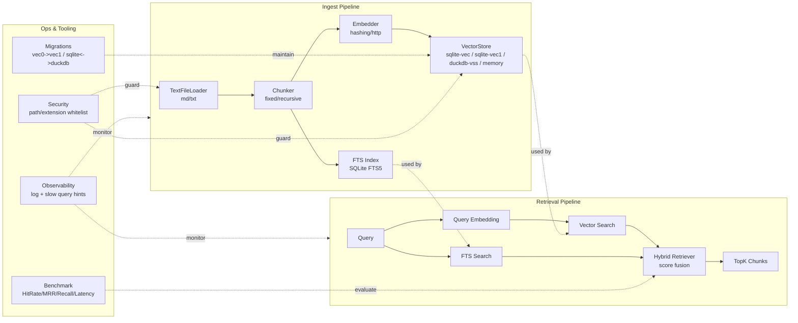

# YFanRAG

面向个人开发者与小团队的本地优先 RAG 工具库，提供文档加载、分块、向量化、检索、融合、评测与迁移能力。  
无需独立向量数据库，直接基于 SQLite / DuckDB 运行。

## 功能概览

- 多后端向量存储：`sqlite-vec`、`sqlite-vec1`、`duckdb-vss`、`memory`
- 检索模式：向量检索、FTS 检索、混合检索（向量 + FTS）
- 数据维护：增量更新、按 `doc_id` 删除、跨后端迁移
- 查询增强：字段过滤、范围过滤、批处理与 embedding 缓存
- 工程能力：Benchmark 报告、统一日志、慢查询提示、安全白名单

## 架构图



## 快速开始

### 1) 安装

```powershell
python -m venv .venv
.\.venv\Scripts\Activate.ps1
pip install -e .[dev]
```

可选依赖：

```powershell
pip install -e .[sqlite]   # sqlite-vec
pip install -e .[duckdb]   # duckdb-vss
```

### 2) 入库

```powershell
yfanrag ingest docs/ --db yfanrag.db --store sqlite-vec --enable-fts
```

可选后端：

```powershell
yfanrag ingest docs/ --db yfanrag.db --store sqlite-vec1
yfanrag ingest docs/ --db yfanrag.duckdb --store duckdb-vss --vss-persistent-index
```

### 3) 检索

向量检索：

```powershell
yfanrag query "hello" --db yfanrag.db --store sqlite-vec --top-k 3
```

全文检索：

```powershell
yfanrag fts-query "hello" --db yfanrag.db --top-k 3
```

混合检索：

```powershell
yfanrag hybrid-query "hello" --db yfanrag.db --store sqlite-vec1 --top-k 3 --alpha 0.5
```

## 常用 CLI 能力

| 命令 | 作用 | 示例 |
| --- | --- | --- |
| `ingest` | 文档分块、向量化并入库（支持增量 upsert） | `yfanrag ingest docs/ --db yfanrag.db --store sqlite-vec1` |
| `query` | 向量检索 | `yfanrag query "vector store" --db yfanrag.db --store duckdb-vss` |
| `fts-query` | SQLite FTS5 检索 | `yfanrag fts-query "sqlite" --db yfanrag.db` |
| `hybrid-query` | 向量 + FTS 融合检索 | `yfanrag hybrid-query "sqlite" --db yfanrag.db --alpha 0.6` |
| `delete` | 按 `doc_id` 删除向量与可选 FTS 索引 | `yfanrag delete --db yfanrag.db --doc-id "file:docs/TECHNICAL.md" --enable-fts` |
| `benchmark` | 生成检索质量与性能报告 | `yfanrag benchmark benchmarks/cases.jsonl --db yfanrag.db --mode hybrid --output report.json` |
| `migrate-vec0-to-vec1` | 将 `sqlite-vec(vec0)` 表迁移到 `vec1` 适配层 | `yfanrag migrate-vec0-to-vec1 --db yfanrag.db` |
| `migrate-sqlite-duckdb` | SQLite(vec1) 与 DuckDB(vss) 双向迁移 | `yfanrag migrate-sqlite-duckdb --direction sqlite-to-duckdb` |

## 查询过滤

字段过滤：

```powershell
yfanrag query "hello" --db yfanrag.db --store sqlite-vec1 --filter "doc_id=file:docs/TECHNICAL.md"
```

范围过滤：

```powershell
yfanrag query "hello" --db yfanrag.db --store sqlite-vec1 --range "start:0:2000" --range "index:0:10"
```

## 批处理与缓存

`ingest` 支持 embedding 批处理和缓存控制：

```powershell
yfanrag ingest docs/ --db yfanrag.db --store sqlite-vec --embed-batch-size 128
yfanrag ingest docs/ --db yfanrag.db --store sqlite-vec --disable-embed-cache
```

## Benchmark 评测

支持 `json` / `jsonl` 数据集，按用例统计：

- `hit_rate`
- `mrr`
- `recall`
- `latency_ms`（`avg/p50/p95/max`）

`cases.jsonl` 每行示例：

```json
{"query":"hello","expected_doc_ids":["file:docs/TECHNICAL.md"]}
```

## 迁移与兼容

vec0 -> vec1：

```powershell
yfanrag migrate-vec0-to-vec1 --db yfanrag.db --source-table vec_chunks
```

SQLite(vec1) <-> DuckDB(vss)：

```powershell
yfanrag migrate-sqlite-duckdb --direction sqlite-to-duckdb --sqlite-db yfanrag.db --duckdb-db yfanrag.duckdb
yfanrag migrate-sqlite-duckdb --direction duckdb-to-sqlite --duckdb-db yfanrag.duckdb --sqlite-db yfanrag.db
```

## 可观测性

全局日志与慢查询阈值：

```powershell
yfanrag --log-level INFO --slow-query-ms 50 query "hello" --db yfanrag.db --store sqlite-vec1
```

也可使用环境变量：

- `YFANRAG_LOG_LEVEL`
- `YFANRAG_SLOW_QUERY_MS`

## 安全与隔离

限制可读路径（防止越权读取）：

```powershell
yfanrag ingest docs/ --path-whitelist "D:\Documents\GitHub\YFanRAG\docs"
```

限制扩展加载路径（防止任意扩展注入）：

```powershell
yfanrag query "hello" --store sqlite-vec1 --sqlite-extension-path "D:\ext\vec1.dll" --extension-whitelist "D:\ext"
```

也可使用环境变量：

- `YFANRAG_PATH_WHITELIST`
- `YFANRAG_EXTENSION_WHITELIST`

## 示例

参见 [examples/README.md](examples/README.md)（含 3 个可运行示例）：

- `examples/01_basic_ingest_query.py`
- `examples/02_hybrid_query.py`
- `examples/03_benchmark.py`

## 开发与发布

运行测试：

```powershell
pytest
```

发布辅助脚本：

```powershell
python scripts/release.py 0.1.0 --dry-run
python scripts/release.py 0.1.0 --tag
```

Windows PowerShell：

```powershell
.\scripts\release.ps1 -Version 0.1.0 -DryRun
```

## 相关文档

- 技术设计与任务表：`docs/TECHNICAL.md`
- 变更记录：`CHANGELOG.md`

## 贡献

欢迎提交 Issue / PR。建议先阅读 `docs/TECHNICAL.md` 的任务表与当前状态。

## License

待定
