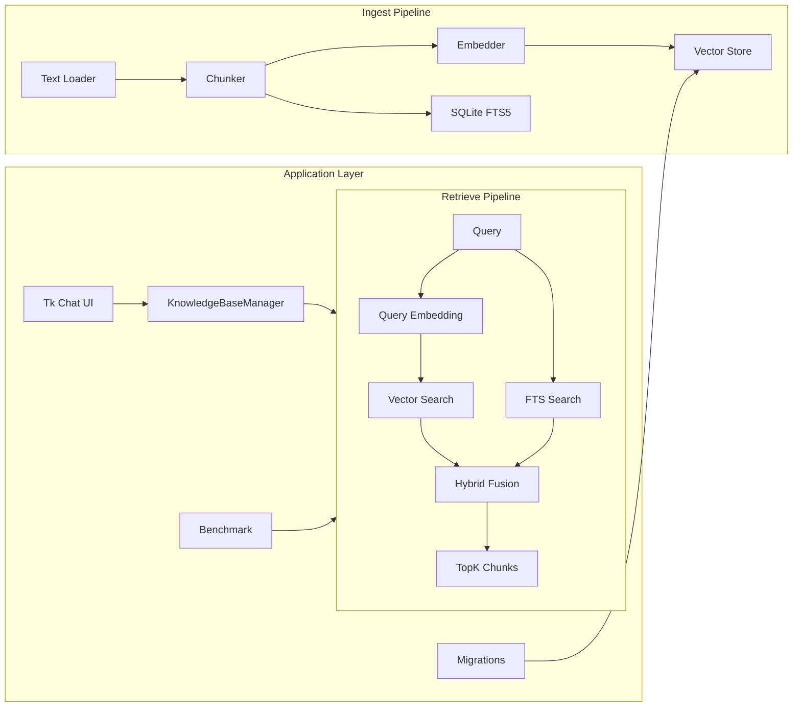

# YFanRAG

English | [简体中文](README.zh-CN.md)

> A local-first RAG toolkit for individual developers and small teams.  
> Run directly on SQLite / DuckDB without a separate vector database.

[Docs](docs/README.md) | [Getting Started](docs/getting-started.md) | [CLI Guide](docs/cli.md) | [Architecture](docs/architecture.md) | [Performance](docs/performance.md) | [GUI Guide](docs/gui.md)

## Highlights

| Area | Capability |
| --- | --- |
| Storage backends | `sqlite-vec`, `sqlite-vec1`, `duckdb-vss`, `memory` |
| Retrieval modes | Vector search, FTS search, hybrid retrieval, adaptive `auto` routing |
| Data handling | Document loading, structure-aware chunking, incremental upsert, delete by `doc_id` |
| Retrieval enhancement | Multi-query expansion, RRF fusion, reranking, context compression and deduplication |
| Engineering support | Benchmarking, migrations, slow-query logs, security whitelists, Tkinter GUI |

## Architecture at a Glance



For a deeper module breakdown, backend comparison, and extension points, see [docs/architecture.md](docs/architecture.md) and [docs/TECHNICAL.md](docs/TECHNICAL.md).

## 30-Second Quick Start

### 1. Install

```powershell
python -m venv .venv
.\.venv\Scripts\Activate.ps1
pip install -e .[dev]
```

Common optional extras:

```powershell
pip install -e .[sqlite]
pip install -e .[duckdb]
pip install -e .[fastembed]
pip install -e .[rerank]
```

### 2. Ingest

```powershell
yfanrag ingest docs/ --db yfanrag.db --store sqlite-vec1 --enable-fts
```

### 3. Query

```powershell
yfanrag query "vector store" --db yfanrag.db --store sqlite-vec1 --top-k 3
yfanrag fts-query "sqlite" --db yfanrag.db --top-k 3
yfanrag hybrid-query "sqlite vector" --db yfanrag.db --store sqlite-vec1 --top-k 3 --alpha 0.5
```

### 4. Run Benchmarks

```powershell
yfanrag benchmark benchmarks/cases.jsonl --db yfanrag.db --mode hybrid --output report.json
.\.venv\Scripts\python scripts\perf_benchmark.py --repeat 5 --warmup 1 --output perf-report.json
```

### 5. Launch the GUI

```powershell
yfanrag chat-ui
```

For full setup details, backend selection, and common workflows, see [docs/getting-started.md](docs/getting-started.md).

## Documentation Map

| Document | Best for | Main content |
| --- | --- | --- |
| [docs/README.md](docs/README.md) | Everyone | Documentation map, reading paths, index |
| [docs/getting-started.md](docs/getting-started.md) | First-time users | Installation, ingest, query, migrations, common workflows |
| [docs/cli.md](docs/cli.md) | CLI users | Command overview, parameters, output formats, recipes |
| [docs/architecture.md](docs/architecture.md) | Readers exploring the design | Architecture, backend comparison, retrieval flows, extension points |
| [docs/gui.md](docs/gui.md) | GUI users | Providers, knowledge base management, feedback loop, FAQ |
| [docs/performance.md](docs/performance.md) | Evaluation and tuning | Quality benchmark, local performance benchmark, interpretation |
| [docs/development.md](docs/development.md) | Contributors | Dev environment, testing, release, doc maintenance |
| [docs/TECHNICAL.md](docs/TECHNICAL.md) | Maintainers | Module map, abstractions, test matrix, technical notes |

## Performance Snapshot

Below is a baseline summary captured on April 6, 2026. See [docs/performance.md](docs/performance.md) for the full method and interpretation.

| Workload | Result |
| --- | --- |
| Ingest | `277.465 ms avg`, about `2988 chunks/s` |
| `fts` query (`core` profile) | `3.171 ms p95` |
| `vector` query (`core` profile) | `54.006 ms p95` |
| `hybrid` query (`default` profile) | `231.182 ms p95` |

These numbers were measured on the `sqlite-vec1` fallback path without the `vec1` extension enabled, so the main cost of `vector / hybrid` comes from SQLite + Python exact scanning.

## Examples

Run directly from the repository root:

```powershell
python examples/01_basic_ingest_query.py
python examples/02_hybrid_query.py
python examples/03_benchmark.py
python examples/04_tk_chat_app.py
```

See [examples/README.md](examples/README.md) for notes.

## Development

```powershell
pytest
python scripts/release.py 0.1.0 --dry-run
.\scripts\release.ps1 -Version 0.1.0 -DryRun
```

See [docs/development.md](docs/development.md) for the full development and release guide.

## License

TBD
