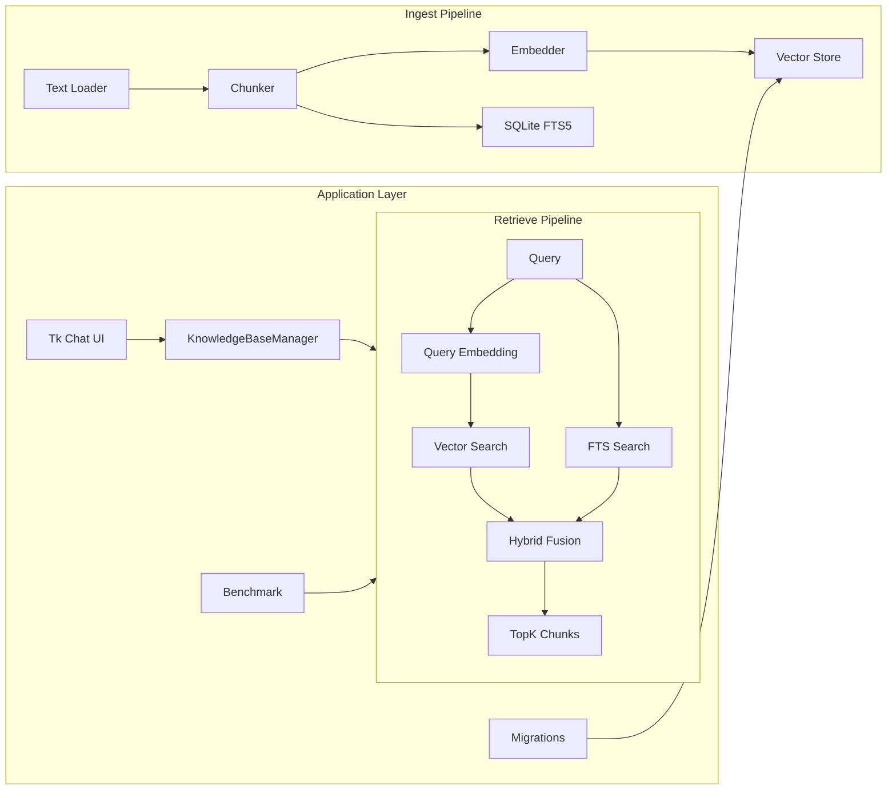

# YFanRAG

[English](README.md) | 简体中文

> 面向个人开发者与小团队的本地优先 RAG 工具库。  
> 直接基于 SQLite / DuckDB 运行，无需独立向量数据库。

[文档中心](docs/README.zh-CN.md) | [快速开始](docs/getting-started.zh-CN.md) | [CLI 指南](docs/cli.zh-CN.md) | [架构设计](docs/architecture.zh-CN.md) | [性能测试](docs/performance.zh-CN.md) | [GUI 指南](docs/gui.zh-CN.md)

## 项目亮点

| 方向 | 能力 |
| --- | --- |
| 存储后端 | `sqlite-vec`、`sqlite-vec1`、`duckdb-vss`、`memory` |
| 检索模式 | 向量检索、FTS 检索、混合检索、`auto` 自适应路由 |
| 数据处理 | 文档加载、结构化分块、增量 upsert、按 `doc_id` 删除 |
| 检索增强 | Multi-Query、RRF 融合、二阶段重排、上下文压缩与去重 |
| 工程能力 | Benchmark、迁移、慢查询日志、安全白名单、Tkinter GUI |

## 架构概览



更详细的模块拆解、后端对比和扩展点见 [docs/architecture.zh-CN.md](docs/architecture.zh-CN.md) 与 [docs/TECHNICAL.zh-CN.md](docs/TECHNICAL.zh-CN.md)。

## 30 秒上手

### 1. 安装

```powershell
python -m venv .venv
.\.venv\Scripts\Activate.ps1
pip install -e .[dev]
```

常见可选依赖：

```powershell
pip install -e .[sqlite]
pip install -e .[duckdb]
pip install -e .[fastembed]
pip install -e .[rerank]
```

### 2. 入库

```powershell
yfanrag ingest docs/ --db yfanrag.db --store sqlite-vec1 --enable-fts
```

### 3. 检索

```powershell
yfanrag query "vector store" --db yfanrag.db --store sqlite-vec1 --top-k 3
yfanrag fts-query "sqlite" --db yfanrag.db --top-k 3
yfanrag hybrid-query "sqlite vector" --db yfanrag.db --store sqlite-vec1 --top-k 3 --alpha 0.5
```

### 4. 跑基准

```powershell
yfanrag benchmark benchmarks/cases.jsonl --db yfanrag.db --mode hybrid --output report.json
.\.venv\Scripts\python scripts\perf_benchmark.py --repeat 5 --warmup 1 --output perf-report.json
```

### 5. 打开图形界面

```powershell
yfanrag chat-ui
```

完整安装、后端选择和常用操作见 [docs/getting-started.zh-CN.md](docs/getting-started.zh-CN.md)。

## 文档导航

| 文档 | 适合谁 | 主要内容 |
| --- | --- | --- |
| [docs/README.zh-CN.md](docs/README.zh-CN.md) | 所有人 | 文档地图、阅读路径、索引 |
| [docs/getting-started.zh-CN.md](docs/getting-started.zh-CN.md) | 初次使用者 | 安装、入库、检索、迁移、常见工作流 |
| [docs/cli.zh-CN.md](docs/cli.zh-CN.md) | CLI 用户 | 命令总览、参数说明、输出格式、配方 |
| [docs/architecture.zh-CN.md](docs/architecture.zh-CN.md) | 想理解设计的人 | 架构、后端对比、检索流程、扩展点 |
| [docs/gui.zh-CN.md](docs/gui.zh-CN.md) | GUI 用户 | Provider、知识库管理、反馈闭环、FAQ |
| [docs/performance.zh-CN.md](docs/performance.zh-CN.md) | 调优与评测 | 质量 benchmark、本地性能测试、结果解读 |
| [docs/development.zh-CN.md](docs/development.zh-CN.md) | 贡献者 | 开发环境、测试、发布、文档维护 |
| [docs/TECHNICAL.zh-CN.md](docs/TECHNICAL.zh-CN.md) | 维护者 | 模块地图、抽象层、测试矩阵、技术备注 |

## 性能快照

以下是 2026-04-06 在本机基线环境上的摘要结果，完整方法和解释见 [docs/performance.zh-CN.md](docs/performance.zh-CN.md)：

| 工作负载 | 结果 |
| --- | --- |
| 入库 | `277.465 ms avg`，约 `2988 chunks/s` |
| `fts` 查询（core profile） | `3.171 ms p95` |
| `vector` 查询（core profile） | `54.006 ms p95` |
| `hybrid` 查询（default profile） | `231.182 ms p95` |

当前这组数据是在未启用 `vec1` 扩展的 `sqlite-vec1` 回退路径上测得，因此 `vector / hybrid` 的主要成本来自 SQLite + Python 精确扫描。

## 示例

可直接从仓库根目录运行：

```powershell
python examples/01_basic_ingest_query.py
python examples/02_hybrid_query.py
python examples/03_benchmark.py
python examples/04_tk_chat_app.py
```

示例说明见 [examples/README.zh-CN.md](examples/README.zh-CN.md)。

## 开发

```powershell
pytest
python scripts/release.py 0.1.0 --dry-run
.\scripts\release.ps1 -Version 0.1.0 -DryRun
```

更完整的开发与发布说明见 [docs/development.zh-CN.md](docs/development.zh-CN.md)。

## License

待定
