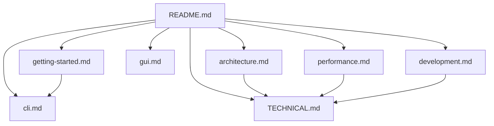

# 文档中心

这里汇总了 YFanRAG 的使用、设计、性能与开发文档。建议从这里进入，再按你的目标跳转到对应主题。

## 阅读路径

### 如果你是第一次使用

1. 读 [快速开始](getting-started.md)
2. 按需要查 [CLI 指南](cli.md)
3. 想直接上图形界面就看 [GUI 指南](gui.md)

### 如果你在调试召回效果或性能

1. 先看 [架构设计](architecture.md)
2. 再看 [性能测试](performance.md)
3. 最后参考 [TECHNICAL.md](TECHNICAL.md) 里的模块地图和测试矩阵

### 如果你准备参与开发

1. 从 [开发指南](development.md) 开始
2. 再看 [TECHNICAL.md](TECHNICAL.md)

## 文档目录

| 文档 | 主题 | 适用场景 |
| --- | --- | --- |
| [getting-started.md](getting-started.md) | 安装与首个工作流 | 想尽快跑起来 |
| [cli.md](cli.md) | CLI 命令与配方 | 命令行使用与自动化 |
| [architecture.md](architecture.md) | 架构、后端、检索链路 | 理解设计与选型 |
| [gui.md](gui.md) | Tkinter Chat Studio | 本地 GUI、知识库管理、反馈闭环 |
| [performance.md](performance.md) | 质量基准与本地性能测试 | 评测、调优、复现实验 |
| [development.md](development.md) | 开发、测试、发布 | 贡献与维护 |
| [TECHNICAL.md](TECHNICAL.md) | 深度技术说明 | 维护者、扩展者 |

## 约定

- 所有命令默认从仓库根目录执行。
- 命令示例默认基于 Windows PowerShell。
- README 中的性能数据带有明确测试日期，后续更新时建议一并更新测试方法与环境。
