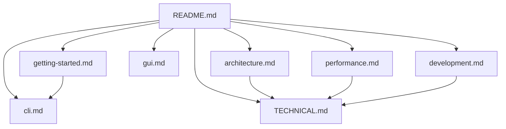

# Documentation Hub

English | [简体中文](README.zh-CN.md)

This page collects the main YFanRAG documentation for usage, design, performance, and development. Start here and then branch out based on your goal.

## Reading Paths

### If You Are New to YFanRAG

1. Read [Getting Started](getting-started.md)
2. Use the [CLI Guide](cli.md) as needed
3. Jump to the [GUI Guide](gui.md) if you want the desktop interface

### If You Are Tuning Retrieval Quality or Performance

1. Start with [Architecture](architecture.md)
2. Continue with [Performance](performance.md)
3. Finish with the module map and test matrix in [TECHNICAL.md](TECHNICAL.md)

### If You Plan to Contribute

1. Begin with [Development](development.md)
2. Then read [TECHNICAL.md](TECHNICAL.md)

## Documentation Index

| Document | Topic | Best for |
| --- | --- | --- |
| [getting-started.md](getting-started.md) | Installation and first workflow | Getting up and running quickly |
| [cli.md](cli.md) | CLI commands and recipes | Command-line usage and automation |
| [architecture.md](architecture.md) | Architecture, backends, retrieval flow | Understanding design and tradeoffs |
| [gui.md](gui.md) | Tkinter Chat Studio | Desktop GUI, KB management, feedback loop |
| [performance.md](performance.md) | Quality and local performance benchmarks | Evaluation, tuning, reproducible measurements |
| [development.md](development.md) | Development, testing, release | Contribution and maintenance |
| [TECHNICAL.md](TECHNICAL.md) | Deep technical notes | Maintainers and extenders |

## Conventions

- All commands are assumed to run from the repository root.
- Command examples are written for Windows PowerShell by default.
- Performance numbers in README files should always include a concrete test date, and updates should refresh the method and environment together.
