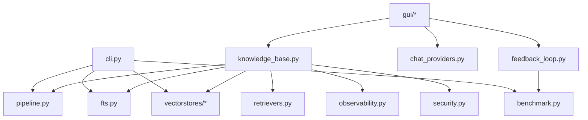

# Technical Notes

本页面记录当前实现的技术结构、核心抽象、模块边界和测试覆盖入口，适合维护者、扩展者和做深度代码审阅的人。

## 模块地图

| 路径 | 责任 |
| --- | --- |
| `yfanrag/cli.py` | CLI 入口、命令组装、参数解析 |
| `yfanrag/knowledge_base.py` | GUI/工具层的高阶编排入口，负责 ingest/query/delete、auto 路由、multi-query、rerank、上下文压缩 |
| `yfanrag/pipeline.py` | 低层 pipeline，负责 chunk -> embed -> store/fts |
| `yfanrag/chunking.py` | `FixedChunker`、`RecursiveChunker`、`StructureAwareChunker` |
| `yfanrag/embedders.py` | `HashingEmbedder`、`FastEmbedder`、`HttpEmbedder` |
| `yfanrag/vectorstores/` | `sqlite_vec`、`sqlite_vec1`、`duckdb_vss`、`memory` |
| `yfanrag/fts.py` | SQLite FTS5 索引与查询 |
| `yfanrag/retrievers.py` | HybridRetriever、分数归一化与融合 |
| `yfanrag/benchmark.py` | 检索质量与延迟统计 |
| `yfanrag/migrations.py` | 各类向量存储迁移 |
| `yfanrag/observability.py` | 日志与慢查询提示 |
| `yfanrag/security.py`、`yfanrag/secure_config.py` | 路径/扩展白名单、安全配置 |
| `yfanrag/gui/` | Tkinter GUI 及 mixin 拆分 |
| `yfanrag/feedback_loop.py` | GUI 反馈闭环、hard case 沉淀与回归 benchmark |

## 依赖关系概览

## 核心抽象

| 抽象 | 作用 |
| --- | --- |
| `Document` | 原始文档，包含 `doc_id`、文本和元数据 |
| `Chunk` | 分块后的最小检索单元，包含 `chunk_id`、范围、文本和 metadata |
| `VectorStore` | 向量存储抽象，支持 `add/query/delete` |
| `Embedder` | embedding 抽象，支持文档与查询向量化 |
| `Chunker` | 分块抽象 |
| `KnowledgeBaseManager` | 面向 GUI 和高阶工具的统一入口 |

## 当前实现状态

| 能力 | 状态 | 说明 |
| --- | --- | --- |
| 文本/代码加载 | 已实现 | 本地路径白名单、编码回退、大小限制 |
| 分块策略 | 已实现 | `fixed` / `recursive` / `structured` |
| 向量存储 | 已实现 | 多后端，部分依赖可选安装 |
| FTS | 已实现 | SQLite FTS5 |
| 混合检索 | 已实现 | 向量 + FTS 分数融合 |
| Auto 路由 | 已实现 | 主要用于 `KnowledgeBaseManager` / GUI |
| Multi-Query / RRF / Reranker | 已实现 | 默认链路中可启用 |
| GUI | 已实现 | Provider 配置、KB 管理、反馈闭环 |
| 迁移 | 已实现 | vec0 -> vec1、SQLite <-> DuckDB |
| 基准测试 | 已实现 | 质量 benchmark + 本地性能 benchmark |

## 性能备注

- `sqlite-vec1` 在无扩展环境下会回退到精确扫描
- `duckdb-vss` 主要面向向量检索，不承担 SQLite FTS 的混合路径
- 默认增强链路包含 multi-query 与 rerank，延迟通常显著高于 raw retrieval

## 扩展建议

如果要新增后端或检索策略，推荐顺序：

1. 先实现最小抽象层
2. 在 `tests/` 新增对应单元测试
3. 在 `docs/architecture.md` 和相关主题文档补充说明
4. 如果影响性能结论，同时更新 `docs/performance.md`

## 测试矩阵入口

| 主题 | 代表测试 |
| --- | --- |
| Chunking | `tests/test_chunking.py` |
| Embedders | `tests/test_embedder_http.py` |
| SQLite stores | `tests/test_sqlite_vec_store.py`、`tests/test_sqlite_vec1_store.py` |
| FTS | `tests/test_sqlite_fts.py` |
| Hybrid retriever | `tests/test_hybrid_retriever.py` |
| Knowledge base | `tests/test_knowledge_base.py` |
| Feedback loop | `tests/test_feedback_loop.py` |
| GUI traceability | `tests/test_gui_chat_traceability.py` |
| Observability / security | `tests/test_observability.py`、`tests/test_secure_config.py` |

## 相关文档

- [架构设计](architecture.md)
- [性能测试](performance.md)
- [开发指南](development.md)
