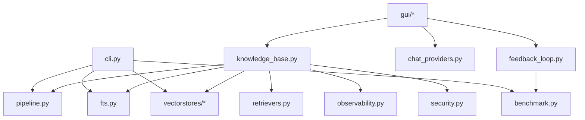

# Technical Notes

English | [简体中文](TECHNICAL.zh-CN.md)

This page records the current implementation structure, core abstractions, module boundaries, and test coverage entry points. It is intended for maintainers, extenders, and deep code reviewers.

## Module Map

| Path | Responsibility |
| --- | --- |
| `yfanrag/cli.py` | CLI entry point, command assembly, argument parsing |
| `yfanrag/knowledge_base.py` | High-level orchestration entry for GUI/tooling: ingest, query, delete, auto routing, multi-query, rerank, context compression |
| `yfanrag/pipeline.py` | Lower-level pipeline for chunk -> embed -> store/fts |
| `yfanrag/chunking.py` | `FixedChunker`, `RecursiveChunker`, `StructureAwareChunker` |
| `yfanrag/embedders.py` | `HashingEmbedder`, `FastEmbedder`, `HttpEmbedder` |
| `yfanrag/vectorstores/` | `sqlite_vec`, `sqlite_vec1`, `duckdb_vss`, `memory` |
| `yfanrag/fts.py` | SQLite FTS5 indexing and querying |
| `yfanrag/retrievers.py` | `HybridRetriever`, score normalization, fusion |
| `yfanrag/benchmark.py` | Retrieval quality and latency aggregation |
| `yfanrag/migrations.py` | Storage migrations across vector backends |
| `yfanrag/observability.py` | Logging and slow-query hints |
| `yfanrag/security.py`, `yfanrag/secure_config.py` | Path/extension whitelists and secure configuration |
| `yfanrag/gui/` | Tkinter GUI and mixin decomposition |
| `yfanrag/feedback_loop.py` | GUI feedback loop, hard-case capture, regression benchmark |

## Dependency Overview

## Core Abstractions

| Abstraction | Purpose |
| --- | --- |
| `Document` | Raw document with `doc_id`, text, and metadata |
| `Chunk` | Smallest retrieval unit with `chunk_id`, range, text, and metadata |
| `VectorStore` | Vector storage abstraction supporting `add/query/delete` |
| `Embedder` | Embedding abstraction for documents and queries |
| `Chunker` | Chunking abstraction |
| `KnowledgeBaseManager` | Unified high-level entry point for GUI and tooling |

## Current Implementation Status

| Capability | Status | Notes |
| --- | --- | --- |
| Text/code loading | Implemented | Local path whitelist, encoding fallback, size limit |
| Chunking strategies | Implemented | `fixed` / `recursive` / `structured` |
| Vector storage | Implemented | Multiple backends with optional dependencies |
| FTS | Implemented | SQLite FTS5 |
| Hybrid retrieval | Implemented | Vector + FTS score fusion |
| Auto routing | Implemented | Mainly used by `KnowledgeBaseManager` and the GUI |
| Multi-Query / RRF / Reranker | Implemented | Available in the default retrieval chain |
| GUI | Implemented | Provider config, KB management, feedback loop |
| Migrations | Implemented | vec0 -> vec1, SQLite <-> DuckDB |
| Benchmarking | Implemented | Quality benchmark + local performance benchmark |

## Performance Notes

- `sqlite-vec1` falls back to exact scanning when no extension is available
- `duckdb-vss` is primarily for vector retrieval and does not carry the SQLite FTS hybrid path
- The default enhanced retrieval chain includes multi-query and reranking, so latency is usually much higher than raw retrieval

## Extension Guidance

If you want to add a backend or retrieval strategy, the recommended order is:

1. Implement the smallest viable abstraction first
2. Add matching tests under `tests/`
3. Update `docs/architecture.md` and the relevant topic docs
4. If the change affects performance conclusions, also update `docs/performance.md`

## Test Matrix Entry Points

| Area | Representative tests |
| --- | --- |
| Chunking | `tests/test_chunking.py` |
| Embedders | `tests/test_embedder_http.py` |
| SQLite stores | `tests/test_sqlite_vec_store.py`, `tests/test_sqlite_vec1_store.py` |
| FTS | `tests/test_sqlite_fts.py` |
| Hybrid retriever | `tests/test_hybrid_retriever.py` |
| Knowledge base | `tests/test_knowledge_base.py` |
| Feedback loop | `tests/test_feedback_loop.py` |
| GUI traceability | `tests/test_gui_chat_traceability.py` |
| Observability / security | `tests/test_observability.py`, `tests/test_secure_config.py` |

## Related Docs

- [Architecture](architecture.md)
- [Performance](performance.md)
- [Development](development.md)
