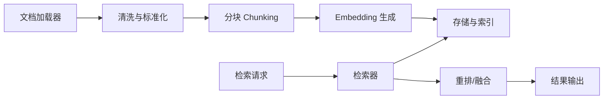

# YFanRAG 技术文档

本文档描述 YFanRAG 的可行性、架构设计、技术栈与开发任务表，面向个人开发者与小项目的极简本地 RAG 需求。

**1. 目标与定位**

YFanRAG 目标是提供一个轻量、易集成、可离线运行的文档向量化与检索库，强调三点：

- 低运维：无需部署大型向量数据库，仅依赖 SQLite 或 DuckDB。
- 极简：API 与概念少，默认配置即可跑通。
- 可扩展：存储、Embedding、分块与检索策略可插拔。

**2. 可行性分析**

**2.1 SQLite 路线**

SQLite 可以通过向量扩展提供向量检索能力，当前有两条主路线。

- `sqlite-vec`：提供 `vec0` 虚表，支持存取与查询浮点、int8、二进制向量；纯 C 实现，轻量且可作为可加载扩展集成；但仍处于 pre-v1，接口与行为可能变化，适合作为 MVP 方案。
- `vec1`：SQLite 官方提供的向量搜索扩展，提供 ANN 能力，支持 L2 与 cosine 距离，使用 IVFADC/OPQ 等方法，代码为可移植 C 并且无外部依赖；适合追求长期稳定与更高检索性能的路线。

全文检索方面，SQLite 的 FTS5 作为虚表模块提供成熟的全文搜索能力，可作为向量检索的互补。

**2.2 DuckDB 路线**

DuckDB 提供实验性的向量检索扩展与全文检索扩展。

- `vss` 扩展提供 HNSW 索引与向量相似度检索（L2、cosine、inner product 等），但整体仍处于实验阶段。
- `vss` 在持久化上需要开启实验性持久化选项，官方提示存在数据一致性或损坏风险。
- `full_text_search` 扩展用于全文检索，创建索引需要显式的 PRAGMA 操作，并且索引不会自动随数据更新而刷新。

**2.3 结论**

对“个人开发者与小项目”的场景，SQLite 与 DuckDB 的向量/全文扩展均可作为可行底座。建议以 SQLite 作为默认后端，DuckDB 作为高吞吐或分析型场景的可选后端。SQLite 路线中 `sqlite-vec` 适合 MVP，`vec1` 适合中长期稳定版本。

**3. 架构设计**

**3.1 总体架构**



**3.2 模块说明**

- 文档加载器：支持 Markdown、TXT，PDF 作为可选插件。
- 清洗与标准化：统一换行、去除噪声、保留结构（标题层级）。
- 分块模块：提供固定窗口、递归结构分块两套策略，支持 overlap。
- Embedding 模块：抽象化 Provider，支持本地模型或外部 API。
- 存储与索引：SQLite 或 DuckDB 适配层，向量索引与元数据存取。
- 检索器：向量检索、全文检索与混合检索三种模式。
- 重排/融合：简单加权或召回融合，可扩展为 reranker。

**4. 数据模型与索引策略**

**4.1 通用逻辑模型**

- `documents`：文档元信息，包含 `doc_id`、`source`、`title`、`metadata_json`、`updated_at`。
- `chunks`：分块文本，包含 `chunk_id`、`doc_id`、`text`、`start`、`end`、`hash`。
- `embeddings`：向量索引表或虚表，包含向量与 `chunk_id` 的映射。
- `fts_index`：全文检索索引，保存 `chunk_id` 与 `text`。

**4.2 SQLite 适配方案**

- `sqlite-vec`：使用 `vec0` 虚表，将 `chunk_id` 与元数据作为列存入同表。
- `vec1`：向量索引表与主数据表分离，`embeddings` 存向量，`chunks` 存文本与元信息。
- FTS5：独立 `fts_index` 虚表，检索后与 `chunks` 做 JOIN。

**4.3 DuckDB 适配方案**

- `vss`：在 `chunks` 或 `embeddings` 表上创建 HNSW 索引。
- `full_text_search`：用 PRAGMA 创建 FTS 索引并手动维护。

**5. 核心流程设计**

**5.1 Ingest 流程**

1. 读取文档与元数据。
2. 清洗与标准化文本。
3. 按策略分块并生成 `chunk_id`。
4. 生成 embedding 并写入向量索引表。
5. 写入全文索引与元数据。

**5.2 更新与删除**

- 通过 `doc_id` 做增量更新，基于 `hash` 识别变化块。
- 删除时先删索引，再删 `chunks` 与 `documents`，避免孤儿索引。

**5.3 检索与融合**

- 向量检索返回 TopK chunk。
- 全文检索返回 TopK chunk。
- 融合策略默认使用分数归一化后加权求和。

**6. 技术栈**

- 语言：Python 作为首选实现语言，提供 CLI 与库接口。
- 数据库：SQLite 或 DuckDB。
- 向量扩展：`sqlite-vec` 或 `vec1`，DuckDB `vss`。
- 全文检索：SQLite FTS5 或 DuckDB `full_text_search`。
- 依赖管理：`uv` 或 `pip`。
- 配置：YAML/JSON。

**6.1 测试体系**

- 测试框架：`pytest`，以单元测试为主，覆盖加载器、分块、Embedding 与向量存储。
- 最小闭环测试：构建简化 pipeline，验证 `ingest -> query` 端到端路径。
- 目标：保持测试执行快速，可在本地与 CI 中轻量运行。

**6.2 Embedding Provider**

- 本地实现：基于 `HashingEmbedder` 的确定性向量，适用于测试与示例。
- API 实现：`HttpEmbedder` 通过 HTTP POST 调用外部服务，默认请求体为 `{\"texts\": [...]}`，响应支持 `{\"embeddings\": [...]}` 或 `{\"data\": [{\"embedding\": ...}]}` 两种格式。

**6.3 SQLite 向量与 FTS 适配**

- SQLite `vec0` 通过可加载扩展提供向量存储与检索，Python 侧需调用 `sqlite_vec.load(conn)` 并使用 `serialize_float32()` 序列化向量。citeturn1view0
- `vec0` 虚表支持辅助列（如 `+text`）与元数据列，适合将文本与向量放在同一表中。citeturn2view0
- KNN 查询使用 `embedding MATCH ? AND k = ?` 语法，其中 `k` 控制 TopK。citeturn3view0
- FTS5 通过 `MATCH` 语法进行全文检索，可与向量检索做混合召回。citeturn0search1

**6.4 CLI**

- `yfanrag ingest`：文档入库，支持 `sqlite-vec` 与 `memory` 后端，支持 FTS 建索引。
- `yfanrag query`：向量检索（TopK）。
- `yfanrag fts-query`：全文检索。

**7. 开发任务表**

| 任务ID | 任务内容 | 验收标准 | 优先级 | 状态 |
| --- | --- | --- | --- | --- |
| T-001 | 定义核心接口与配置模型 | 完成公共 API 草案与配置 schema | P0 | 已完成 |
| T-002 | 文档加载器基础实现 | 支持 md/txt，提供统一 Document 结构 | P0 | 已完成 |
| T-003 | 分块策略模块 | 固定窗口与递归分块可用 | P0 | 已完成 |
| T-004 | Embedding Provider 抽象 | 支持本地与 API 两类实现 | P0 | 已完成 |
| T-005 | SQLite `sqlite-vec` 适配层 | 可建库、写入向量、TopK 检索 | P0 | 已完成 |
| T-006 | SQLite `vec1` 适配层 | 可建索引与检索，含迁移策略 | P1 | 未开始 |
| T-007 | DuckDB `vss` 适配层 | 可建索引与检索，含持久化配置 | P1 | 未开始 |
| T-008 | FTS 适配层 | SQLite FTS5 与 DuckDB FTS 可用 | P1 | 已完成 |
| T-009 | 混合检索融合器 | 向量+FTS 加权融合可用 | P1 | 未开始 |
| T-010 | 增量更新与删除 | 文档更新不会产生孤儿索引 | P1 | 未开始 |
| T-011 | 元数据过滤 | 支持过滤字段与范围查询 | P1 | 未开始 |
| T-012 | 批处理与缓存 | 支持批量 embedding 与写入 | P2 | 未开始 |
| T-013 | CLI 原型 | 支持 ingest/query/rebuild | P2 | 已完成 |
| T-014 | 测试体系 | 单元与集成测试覆盖核心路径 | P1 | 已完成 |
| T-015 | Benchmark 与评估脚本 | 可生成检索质量与性能报告 | P2 | 未开始 |
| T-016 | 示例与教程 | 至少 3 个可运行示例 | P2 | 未开始 |
| T-017 | 版本与发布流程 | tag、changelog、发布脚本 | P2 | 未开始 |
| T-018 | 迁移与兼容策略 | SQLite 与 DuckDB 数据可迁移 | P2 | 未开始 |
| T-019 | 观测与日志 | 提供统一日志与慢查询提示 | P2 | 未开始 |
| T-020 | 安全与隔离 | 限制扩展加载与路径白名单 | P2 | 未开始 |
| T-021 | 最小闭环 | 可完成 ingest -> query 的端到端最小流程 | P0 | 已完成 |
| T-022 | 开发环境 | 提供虚拟环境与测试运行说明 | P1 | 已完成 |

**8. 风险与约束**

- 向量扩展稳定性：`sqlite-vec` 处于 pre-v1，接口可能变化，需适配层隔离风险。
- DuckDB `vss` 为实验性扩展，持久化存在风险，默认需关闭或显式标注。
- FTS 索引维护：DuckDB FTS 索引不会自动更新，必须在更新后重建。

**9. 里程碑建议**

- M1：SQLite `sqlite-vec` 端到端可用，支持 ingest 与 query。
- M2：加入 FTS 与混合检索，CLI 原型可用。
- M3：加入 `vec1` 与 DuckDB 适配层，补齐测试与评估。
- M4：发布 0.1 版本，提供示例与文档站点。

**10. 参考资料**

以下为主要参考资料的原始链接，便于后续跟踪版本变更：

```
https://github.com/asg017/sqlite-vec
https://sqlite.org/vec1
https://duckdb.org/docs/stable/core_extensions/vss.html
https://duckdb.org/docs/stable/core_extensions/full_text_search.html
https://sqlite.org/fts5.html
```
