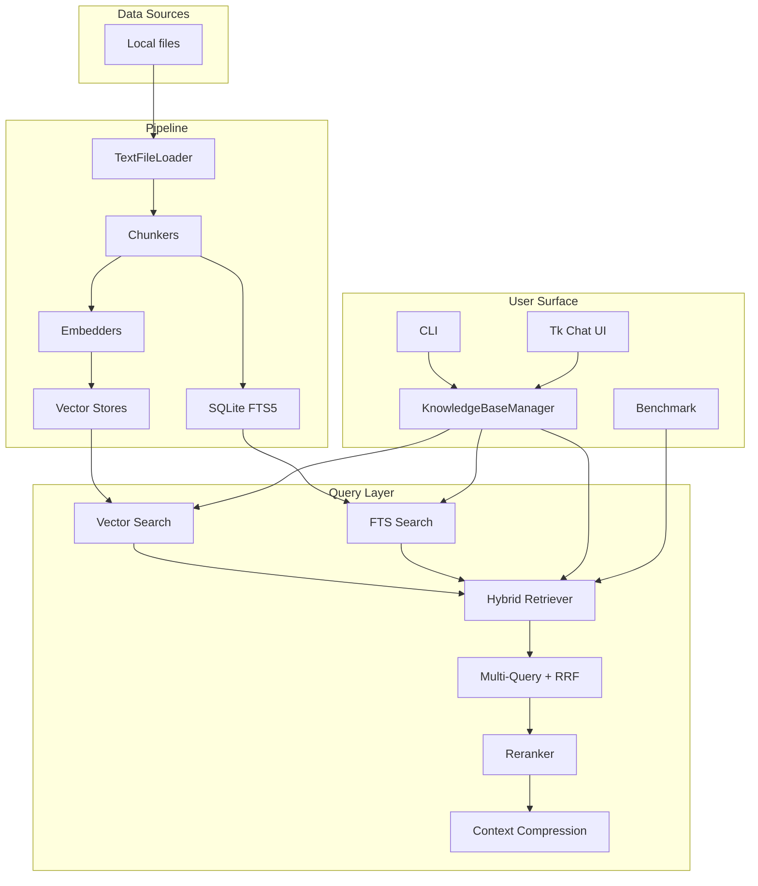
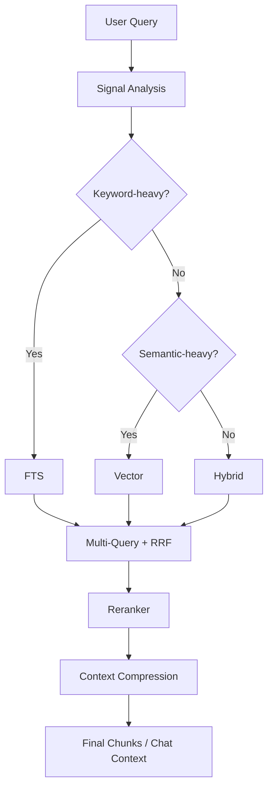

# Architecture

English | [简体中文](architecture.zh-CN.md)

YFanRAG is designed to compress the core pieces of local RAG into a lightweight, embeddable, and testable codebase while still keeping backend flexibility, retrieval enhancement, and a desktop GUI entry point.

## Overall Architecture

## Component Responsibilities

| Layer | Main modules | Responsibility |
| --- | --- | --- |
| I/O | `yfanrag/loaders/text.py` | Reads local text/code files and enforces path whitelists |
| Chunking | `yfanrag/chunking.py` | `fixed`, `recursive`, and `structured` chunking |
| Embedding | `yfanrag/embedders.py` | `hashing`, `fastembed`, and `http` embedding interfaces |
| Storage | `yfanrag/vectorstores/*.py` | SQLite / DuckDB / memory vector store abstractions |
| FTS | `yfanrag/fts.py` | SQLite FTS5 indexing and search |
| Retrieval | `yfanrag/retrievers.py` | Hybrid retrieval and score fusion |
| Orchestration | `yfanrag/pipeline.py`, `yfanrag/knowledge_base.py` | Ingest, query, rerank, context compression, GUI support |
| App | `yfanrag/cli.py`, `yfanrag/gui/*` | CLI and Tkinter screens |
| Ops | `yfanrag/benchmark.py`, `yfanrag/migrations.py`, `yfanrag/observability.py` | Benchmarking, migration, logging, slow-query hints |

## Retrieval Decision Flow

The `auto` mode primarily lives in `KnowledgeBaseManager` and the GUI. It switches between `fts`, `vector`, and `hybrid` based on query signals.

## Backend Comparison

| Backend | Dependency | Strengths | Constraints |
| --- | --- | --- | --- |
| `sqlite-vec1` | SQLite with optional vec1 extension | Default recommendation, easy distribution, graceful fallback | Vector search degrades to exact scanning without the extension |
| `sqlite-vec` | `sqlite-vec` extension | Good fit for sqlite-vec environments | Requires the extension explicitly |
| `duckdb-vss` | `duckdb` | Natural fit for DuckDB workflows and persistent indexes | Current hybrid + FTS flow does not use this backend |
| `memory` | none | Zero dependency, test friendly | Not persistent |

## Structure-Aware Chunking

| Chunker | Best for | Notes |
| --- | --- | --- |
| `structured` | Markdown, Python, JS/TS | Detects semantic boundaries like headings, functions, and classes |
| `recursive` | General text | Recursively splits on a hierarchy of separators |
| `fixed` | Simple cases | Fixed-size windows |

## Security and Observability

- Path whitelists limit what the loader can read
- Extension whitelists limit where SQLite extensions can be loaded from
- Unified logging exposes a global log level
- Slow-query thresholds can flag expensive vector, FTS, and pipeline operations

## Extension Points

The most common extension points are:

- Add a new loader for another document source
- Add a new embedder for another embedding provider
- Add a new vector store that implements the `VectorStore` abstraction
- Adjust the retrieval pipeline with new rerankers, fusion methods, or compression strategies

See [TECHNICAL.md](TECHNICAL.md) for a deeper module map.
