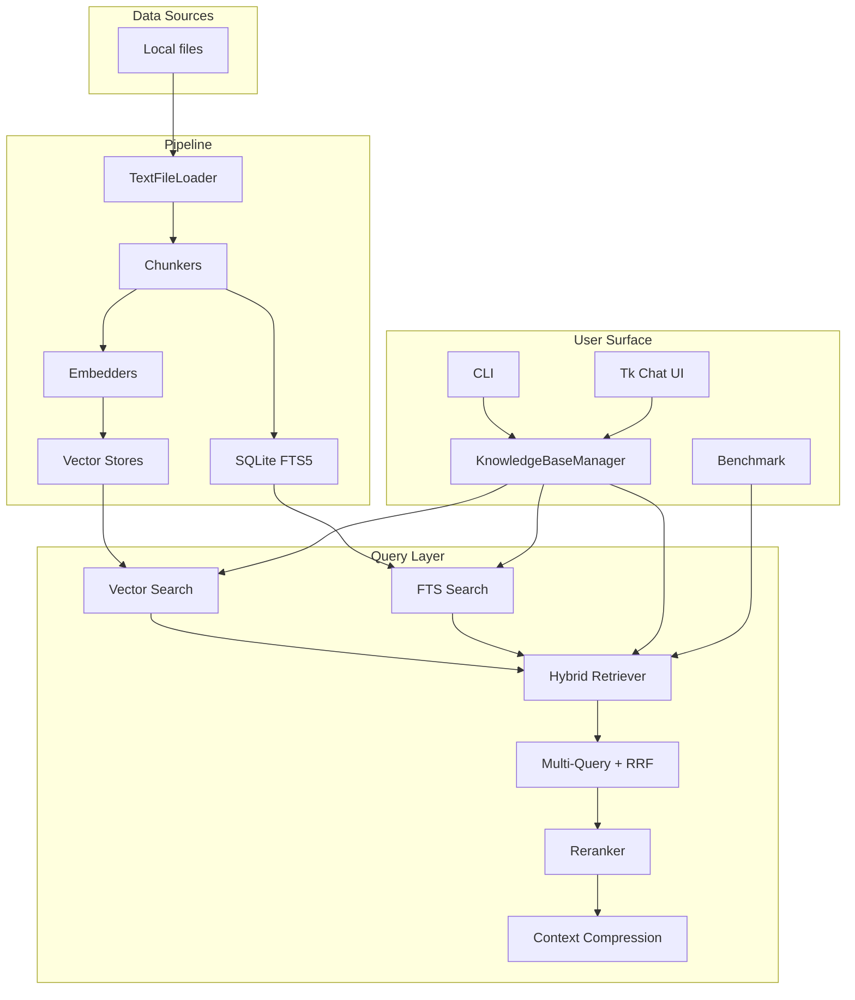
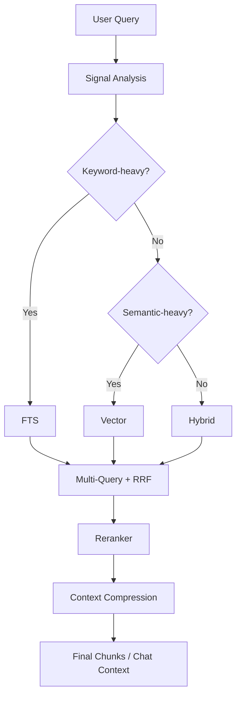

# 架构设计

YFanRAG 的设计目标是把本地 RAG 所需的核心环节压缩到一个轻量、可嵌入、可测试的代码库里，同时保留后端切换、检索增强和 GUI 入口。

## 总体架构

## 组件职责

| 层级 | 主要模块 | 责任 |
| --- | --- | --- |
| I/O | `yfanrag/loaders/text.py` | 读取本地文本/代码文件，执行路径白名单检查 |
| Chunking | `yfanrag/chunking.py` | `fixed` / `recursive` / `structured` 分块 |
| Embedding | `yfanrag/embedders.py` | `hashing`、`fastembed`、`http` embedding 接口 |
| Storage | `yfanrag/vectorstores/*.py` | SQLite / DuckDB / Memory 向量存储抽象 |
| FTS | `yfanrag/fts.py` | SQLite FTS5 建索引与检索 |
| Retrieval | `yfanrag/retrievers.py` | 混合检索与分数融合 |
| Orchestration | `yfanrag/pipeline.py`、`yfanrag/knowledge_base.py` | 入库、查询、rerank、上下文压缩、GUI 支撑 |
| App | `yfanrag/cli.py`、`yfanrag/gui/*` | CLI 与 Tkinter 页面 |
| Ops | `yfanrag/benchmark.py`、`yfanrag/migrations.py`、`yfanrag/observability.py` | 评测、迁移、日志与慢查询提示 |

## 检索决策流程

`auto` 模式主要存在于 `KnowledgeBaseManager` 和 GUI 中。它会根据信号强弱在 `fts`、`vector`、`hybrid` 之间切换。

## 后端对比

| Backend | 依赖 | 优势 | 约束 |
| --- | --- | --- | --- |
| `sqlite-vec1` | SQLite，可选 vec1 扩展 | 默认推荐、易分发、可回退运行 | 没有扩展时向量检索会退化为精确扫描 |
| `sqlite-vec` | `sqlite-vec` 扩展 | 面向 sqlite-vec 生态 | 需要显式安装扩展 |
| `duckdb-vss` | `duckdb` | 适合 DuckDB 工作流，可建持久索引 | 当前混合检索与 FTS 不走该后端 |
| `memory` | 无 | 零依赖、测试友好 | 不持久化 |

## 结构化分块策略

| Chunker | 适合内容 | 说明 |
| --- | --- | --- |
| `structured` | Markdown、Python、JS/TS | 识别标题、函数、类等语义边界 |
| `recursive` | 通用文本 | 基于分隔符逐级递归切分 |
| `fixed` | 最朴素场景 | 固定窗口切块 |

## 安全与可观测性

- 路径白名单：限制 loader 读取范围
- 扩展白名单：限制 SQLite 扩展注入路径
- 统一日志：支持全局日志级别
- 慢查询阈值：向量检索、FTS、pipeline 关键步骤都可记录慢查询

## 扩展点

如果你准备扩展项目，最常见的入口是：

- 新增 loader：实现新的文档来源
- 新增 embedder：适配不同 embedding provider
- 新增 vector store：实现 `VectorStore` 抽象
- 调整检索链路：扩展 reranker、fusion、压缩策略

更细的模块地图见 [TECHNICAL.md](TECHNICAL.md)。
