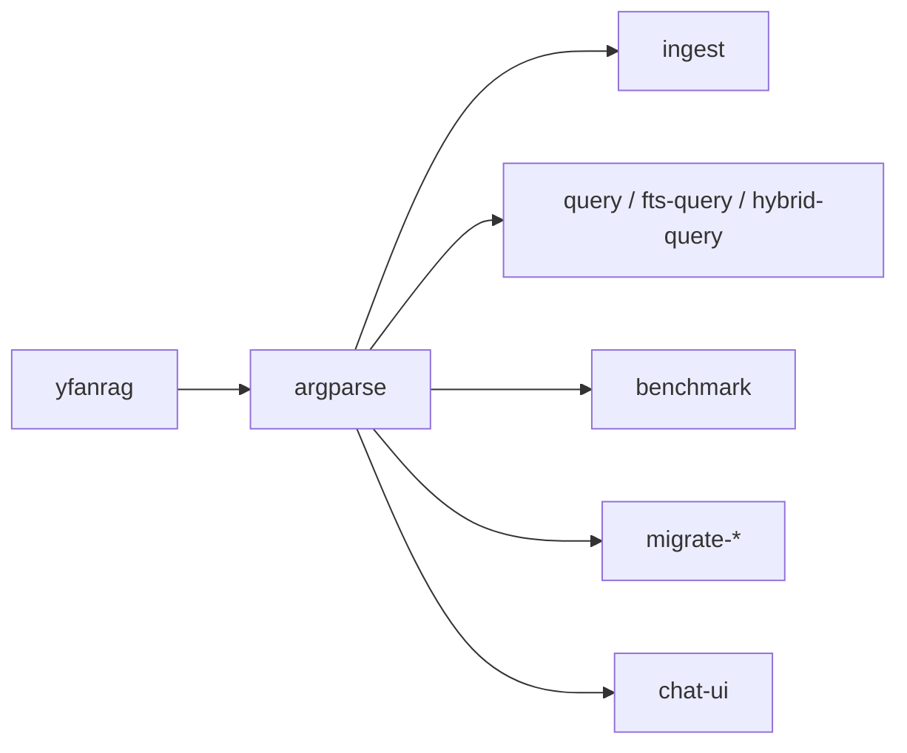

# CLI 指南

YFanRAG 提供一个统一的 `yfanrag` CLI，用于入库、查询、评测、迁移和启动图形界面。



## 全局参数

```powershell
yfanrag --help
```

全局参数：

- `--log-level INFO|DEBUG|...`
- `--slow-query-ms 50`

## 命令总览

| 命令 | 作用 | 典型输入 | 典型输出 |
| --- | --- | --- | --- |
| `ingest` | 文档分块、向量化并入库 | 路径、store、chunker、embedder | 文本摘要 |
| `query` | 向量检索 | query、store、top-k、filters | 每行一个 JSON 结果 |
| `fts-query` | SQLite FTS5 检索 | query、top-k | 每行一个 JSON 结果 |
| `hybrid-query` | 向量 + FTS 融合 | query、alpha、score-norm | 每行一个 JSON 结果 |
| `delete` | 按 `doc_id` 删除 | doc-id 列表 | JSON 摘要 |
| `benchmark` | 质量与延迟基准 | dataset、mode、output | JSON 报告 |
| `migrate-vec0-to-vec1` | vec0 -> vec1 迁移 | db、source/target tables | JSON 摘要 |
| `migrate-sqlite-duckdb` | SQLite / DuckDB 双向迁移 | direction、db paths | JSON 摘要 |
| `chat-ui` | 启动 Tkinter GUI | 无 | 打开窗口 |

## `ingest`

```powershell
yfanrag ingest docs/ --db yfanrag.db --store sqlite-vec1 --enable-fts
```

高频参数：

- `paths...`：文件或目录，支持多个
- `--store sqlite-vec|sqlite-vec1|duckdb-vss|memory`
- `--chunker fixed|recursive|structured`
- `--chunk-size` / `--chunk-overlap`
- `--embedder auto|hashing|fastembed|http`
- `--embed-batch-size`
- `--disable-embed-cache`
- `--enable-fts`
- `--path-whitelist <path>`：可重复
- `--distance-metric l2|cosine`

### 示例

```powershell
yfanrag ingest docs/ src/ --db yfanrag.db --store sqlite-vec1 --enable-fts
yfanrag ingest docs/ --db yfanrag.duckdb --store duckdb-vss --vss-persistent-index
yfanrag ingest docs/ --db yfanrag.db --store sqlite-vec1 --embedder http --endpoint http://localhost:8000/embed
```

## `query` / `fts-query` / `hybrid-query`

向量检索：

```powershell
yfanrag query "vector store" --db yfanrag.db --store sqlite-vec1 --top-k 5
```

FTS：

```powershell
yfanrag fts-query "sqlite" --db yfanrag.db --top-k 5
```

混合检索：

```powershell
yfanrag hybrid-query "sqlite vector" --db yfanrag.db --store sqlite-vec1 --top-k 5 --alpha 0.5
```

### 过滤语法

字段过滤：

```powershell
--filter "doc_id=file:docs/TECHNICAL.md"
```

范围过滤：

```powershell
--range "start:0:2000"
--range "index:0:10"
```

可用于范围过滤的 key：`start`、`end`、`index`。

### 查询输出

`query`、`fts-query`、`hybrid-query` 会逐行输出 JSON，便于 shell 管道或日志采集。例如：

```json
{"rank":1,"chunk_id":"...","doc_id":"file:docs/TECHNICAL.md","text":"..."}
```

## `benchmark`

```powershell
yfanrag benchmark benchmarks/cases.jsonl --db yfanrag.db --mode hybrid --output report.json
```

支持模式：

- `vector`
- `fts`
- `hybrid`

关键参数：

- `--top-k`
- `--case-limit`
- `--alpha`
- `--score-norm sigmoid|minmax|none`
- `--vector-top-k`
- `--fts-top-k`
- `--filter`
- `--range`

输出为一个完整 JSON 文档，包含：

- `hit_rate`
- `mrr`
- `recall`
- `latency_ms.avg/p50/p95/max`
- `cases`

## 迁移命令

vec0 -> vec1：

```powershell
yfanrag migrate-vec0-to-vec1 --db yfanrag.db --source-table vec_chunks
```

SQLite(vec1) <-> DuckDB(vss)：

```powershell
yfanrag migrate-sqlite-duckdb --direction sqlite-to-duckdb --sqlite-db yfanrag.db --duckdb-db yfanrag.duckdb
yfanrag migrate-sqlite-duckdb --direction duckdb-to-sqlite --duckdb-db yfanrag.duckdb --sqlite-db yfanrag.db
```

## `chat-ui`

```powershell
yfanrag chat-ui
```

该命令会启动 Tkinter 图形界面，具体页面结构和知识库管理流程见 [gui.md](gui.md)。

## 安全与可观测性

慢查询日志：

```powershell
yfanrag --log-level INFO --slow-query-ms 50 query "hello" --db yfanrag.db --store sqlite-vec1
```

白名单限制：

```powershell
yfanrag ingest docs/ --path-whitelist "D:\Documents\GitHub\YFanRAG\docs"
yfanrag query "hello" --store sqlite-vec1 --sqlite-extension-path "D:\ext\vec1.dll" --extension-whitelist "D:\ext"
```

## 进一步阅读

- [快速开始](getting-started.md)
- [架构设计](architecture.md)
- [性能测试](performance.md)
