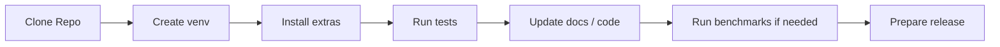

# 开发指南

本页面面向维护者与贡献者，聚焦本地开发环境、测试、发布和文档维护流程。



## 本地开发环境

```powershell
python -m venv .venv
.\.venv\Scripts\Activate.ps1
pip install -e .[dev]
```

按需要追加：

```powershell
pip install -e .[sqlite,duckdb,fastembed,rerank,flashrank,secure]
```

## 测试

运行全部测试：

```powershell
pytest
```

按主题运行：

```powershell
pytest tests/test_knowledge_base.py
pytest tests/test_sqlite_vec1_store.py
pytest tests/test_sqlite_fts.py
pytest tests/test_feedback_loop.py
```

## 质量与性能验证

检索质量：

```powershell
yfanrag benchmark benchmarks/cases.jsonl --db yfanrag.db --mode hybrid --output report.json
```

本地性能：

```powershell
.\.venv\Scripts\python scripts\perf_benchmark.py --repeat 5 --warmup 1 --output perf-report.json
```

## 发布

Python 脚本：

```powershell
python scripts/release.py 0.1.0 --dry-run
python scripts/release.py 0.1.0 --tag
```

PowerShell：

```powershell
.\scripts\release.ps1 -Version 0.1.0 -DryRun
```

## 文档维护建议

- 根 README 保持为 GitHub 首页，重点放导航、亮点、快速开始和摘要数据
- 详细说明写入 `docs/` 中的主题页面
- 更新性能数据时，同时更新测试日期、环境、命令和结果说明
- 新增重要功能时，至少同步更新：
  - `README.md`
  - `docs/README.md`
  - 对应主题文档

## 贡献建议

- 小改动可直接 PR
- 涉及检索链路、后端选择或 GUI 行为的改动，建议同时补测试与文档
- 涉及性能结论的改动，建议附带新的 benchmark 数据

## 进一步阅读

- [文档中心](README.md)
- [TECHNICAL.md](TECHNICAL.md)
