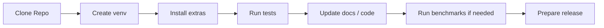

# Development

English | [简体中文](development.zh-CN.md)

This page is for maintainers and contributors. It focuses on the local development environment, testing, release flow, and documentation maintenance.



## Local Development Environment

```powershell
python -m venv .venv
.\.venv\Scripts\Activate.ps1
pip install -e .[dev]
```

Add extras as needed:

```powershell
pip install -e .[sqlite,duckdb,fastembed,rerank,flashrank,secure]
```

## Testing

Run the full test suite:

```powershell
pytest
```

Run focused test groups:

```powershell
pytest tests/test_knowledge_base.py
pytest tests/test_sqlite_vec1_store.py
pytest tests/test_sqlite_fts.py
pytest tests/test_feedback_loop.py
```

## Quality and Performance Validation

Retrieval quality:

```powershell
yfanrag benchmark benchmarks/cases.jsonl --db yfanrag.db --mode hybrid --output report.json
```

Local performance:

```powershell
.\.venv\Scripts\python scripts\perf_benchmark.py --repeat 5 --warmup 1 --output perf-report.json
```

## Release

Python helper:

```powershell
python scripts/release.py 0.1.0 --dry-run
python scripts/release.py 0.1.0 --tag
```

PowerShell:

```powershell
.\scripts\release.ps1 -Version 0.1.0 -DryRun
```

## Documentation Maintenance Notes

- Keep the root README as a GitHub-friendly landing page focused on navigation, highlights, quick start, and summary data
- Move detailed explanations into topic pages under `docs/`
- When performance data changes, update the test date, environment, commands, and interpretation together
- When a major feature is added, update at least:
  - `README.md`
  - `docs/README.md`
  - the matching topic document

## Contribution Suggestions

- Small changes can go straight into a PR
- Changes that affect retrieval flow, backend choice, or GUI behavior should usually include tests and docs
- Changes that affect performance conclusions should come with updated benchmark data

## Further Reading

- [Documentation Hub](README.md)
- [TECHNICAL.md](TECHNICAL.md)
