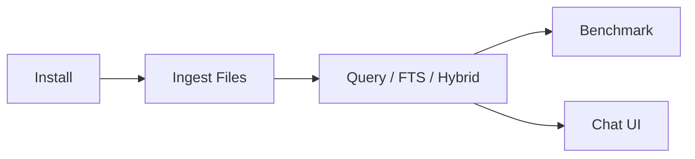

# Getting Started

English | [简体中文](getting-started.zh-CN.md)

This page is for first-time YFanRAG users. The goal is to get you through installation, ingest, querying, and baseline evaluation in just a few minutes.



## Requirements

- Python `>= 3.10`
- Local filesystem read/write access
- Optional: `sqlite-vec`, `duckdb`, `fastembed`, `sentence-transformers`, `flashrank`

## Installation

Base installation:

```powershell
python -m venv .venv
.\.venv\Scripts\Activate.ps1
pip install -e .[dev]
```

Common optional extras:

| Extras | Purpose |
| --- | --- |
| `.[sqlite]` | Enable the `sqlite-vec` backend |
| `.[duckdb]` | Enable the `duckdb-vss` backend |
| `.[fastembed]` | Enable local semantic embeddings |
| `.[rerank]` | Enable cross-encoder reranking |
| `.[flashrank]` | Enable FlashRank reranking |
| `.[secure]` | Enable keyring-based secure configuration and related helpers |

Example:

```powershell
pip install -e .[dev,duckdb,fastembed,rerank]
```

## Choosing a Storage Backend

| Store | Best for | Notes |
| --- | --- | --- |
| `sqlite-vec1` | Default recommendation, local projects, zero extra services | Falls back gracefully even without the vec1 extension |
| `sqlite-vec` | Environments already standardized on sqlite-vec | Requires the matching extension |
| `duckdb-vss` | DuckDB-centric and analytics-oriented workflows | Hybrid retrieval depends on SQLite FTS and does not use this backend |
| `memory` | Demos, tests, one-off scripts | Not persistent |

## First Workflow

### 1. Ingest

```powershell
yfanrag ingest docs/ --db yfanrag.db --store sqlite-vec1 --enable-fts
```

Common flags:

- `--chunker structured`: use structure-aware chunking for `.md/.py/.js/.ts`
- `--embed-batch-size 128`: increase embedding batch size
- `--disable-embed-cache`: disable embedding cache
- `--path-whitelist <path>`: restrict readable paths

### 2. Query

Vector search:

```powershell
yfanrag query "vector store" --db yfanrag.db --store sqlite-vec1 --top-k 3
```

FTS search:

```powershell
yfanrag fts-query "sqlite" --db yfanrag.db --top-k 3
```

Hybrid retrieval:

```powershell
yfanrag hybrid-query "sqlite vector" --db yfanrag.db --store sqlite-vec1 --top-k 3 --alpha 0.5
```

### 3. Filters

Field equality filter:

```powershell
yfanrag query "hello" --db yfanrag.db --store sqlite-vec1 --filter "doc_id=file:docs/TECHNICAL.md"
```

Range filter:

```powershell
yfanrag query "hello" --db yfanrag.db --store sqlite-vec1 --range "start:0:2000" --range "index:0:10"
```

### 4. Run a Retrieval Quality Benchmark

```powershell
yfanrag benchmark benchmarks/cases.jsonl --db yfanrag.db --mode hybrid --output report.json
```

Example row in `cases.jsonl`:

```json
{"query":"hello","expected_doc_ids":["file:docs/TECHNICAL.md"]}
```

### 5. Launch the GUI

```powershell
yfanrag chat-ui
```

Or:

```powershell
python examples/04_tk_chat_app.py
```

## Common Workflows

| Goal | Command |
| --- | --- |
| Incremental document upsert | `yfanrag ingest docs/ --db yfanrag.db --store sqlite-vec1 --enable-fts` |
| Delete a document | `yfanrag delete --db yfanrag.db --store sqlite-vec1 --doc-id "file:docs/TECHNICAL.md" --enable-fts` |
| vec0 -> vec1 migration | `yfanrag migrate-vec0-to-vec1 --db yfanrag.db --source-table vec_chunks` |
| SQLite <-> DuckDB migration | `yfanrag migrate-sqlite-duckdb --direction sqlite-to-duckdb` |
| Local performance benchmark | `.\.venv\Scripts\python scripts\perf_benchmark.py --repeat 5 --warmup 1 --output perf-report.json` |

## Next Steps

- Want the full command surface: read the [CLI Guide](cli.md)
- Want to understand the system design: read [Architecture](architecture.md)
- Want to evaluate performance: read [Performance](performance.md)
- Want to use the desktop interface: read the [GUI Guide](gui.md)
