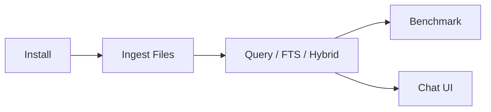

# 快速开始

[English](getting-started.md) | 简体中文

本页面面向第一次接触 YFanRAG 的使用者，目标是让你在几分钟内完成安装、入库、查询和基础评测。



## 环境要求

- Python `>= 3.10`
- 本地文件系统读写权限
- 可选：`sqlite-vec`、`duckdb`、`fastembed`、`sentence-transformers`、`flashrank`

## 安装

基础安装：

```powershell
python -m venv .venv
.\.venv\Scripts\Activate.ps1
pip install -e .[dev]
```

常见可选依赖：

| Extras | 用途 |
| --- | --- |
| `.[sqlite]` | 启用 `sqlite-vec` 后端 |
| `.[duckdb]` | 启用 `duckdb-vss` 后端 |
| `.[fastembed]` | 启用本地语义 embedding |
| `.[rerank]` | 启用 cross-encoder reranker |
| `.[flashrank]` | 启用 FlashRank reranker |
| `.[secure]` | 启用 keyring 等安全配置能力 |

示例：

```powershell
pip install -e .[dev,duckdb,fastembed,rerank]
```

## 如何选择存储后端

| Store | 适合场景 | 备注 |
| --- | --- | --- |
| `sqlite-vec1` | 默认推荐、本地项目、无需额外服务 | 即使没有 vec1 扩展也可回退运行 |
| `sqlite-vec` | 已明确使用 sqlite-vec 的环境 | 需要安装对应扩展 |
| `duckdb-vss` | DuckDB 数据栈、分析型工作流 | 混合检索依赖 SQLite FTS，不适用于该后端 |
| `memory` | Demo、测试、一次性脚本 | 不持久化 |

## 首次工作流

### 1. 入库

```powershell
yfanrag ingest docs/ --db yfanrag.db --store sqlite-vec1 --enable-fts
```

常用参数：

- `--chunker structured`：对 `.md/.py/.js/.ts` 做结构化分块
- `--embed-batch-size 128`：调大 embedding 批量
- `--disable-embed-cache`：关闭 embedding 缓存
- `--path-whitelist <path>`：限制可读取路径

### 2. 查询

向量检索：

```powershell
yfanrag query "vector store" --db yfanrag.db --store sqlite-vec1 --top-k 3
```

全文检索：

```powershell
yfanrag fts-query "sqlite" --db yfanrag.db --top-k 3
```

混合检索：

```powershell
yfanrag hybrid-query "sqlite vector" --db yfanrag.db --store sqlite-vec1 --top-k 3 --alpha 0.5
```

### 3. 条件过滤

字段过滤：

```powershell
yfanrag query "hello" --db yfanrag.db --store sqlite-vec1 --filter "doc_id=file:docs/TECHNICAL.md"
```

范围过滤：

```powershell
yfanrag query "hello" --db yfanrag.db --store sqlite-vec1 --range "start:0:2000" --range "index:0:10"
```

### 4. 跑检索质量 Benchmark

```powershell
yfanrag benchmark benchmarks/cases.jsonl --db yfanrag.db --mode hybrid --output report.json
```

`cases.jsonl` 每行示例：

```json
{"query":"hello","expected_doc_ids":["file:docs/TECHNICAL.md"]}
```

### 5. 打开图形界面

```powershell
yfanrag chat-ui
```

或：

```powershell
python examples/04_tk_chat_app.py
```

## 常见工作流

| 目标 | 命令 |
| --- | --- |
| 增量 upsert 文档 | `yfanrag ingest docs/ --db yfanrag.db --store sqlite-vec1 --enable-fts` |
| 删除文档 | `yfanrag delete --db yfanrag.db --store sqlite-vec1 --doc-id "file:docs/TECHNICAL.md" --enable-fts` |
| vec0 -> vec1 迁移 | `yfanrag migrate-vec0-to-vec1 --db yfanrag.db --source-table vec_chunks` |
| SQLite <-> DuckDB 迁移 | `yfanrag migrate-sqlite-duckdb --direction sqlite-to-duckdb` |
| 本地性能测试 | `.\.venv\Scripts\python scripts\perf_benchmark.py --repeat 5 --warmup 1 --output perf-report.json` |

## 下一步

- 想全面掌握命令用法：看 [CLI 指南](cli.zh-CN.md)
- 想理解系统设计：看 [架构设计](architecture.zh-CN.md)
- 想评估性能：看 [性能测试](performance.zh-CN.md)
- 想直接使用 GUI：看 [GUI 指南](gui.zh-CN.md)
