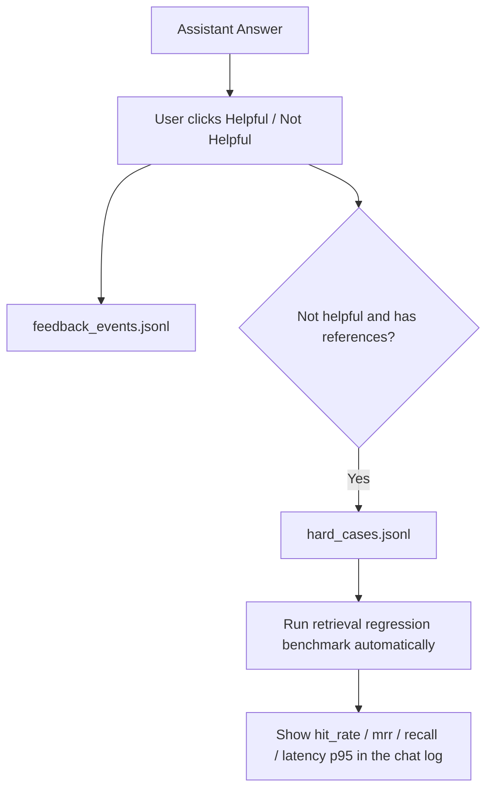

# GUI Guide

English | [简体中文](gui.zh-CN.md)

YFanRAG ships with a Tkinter-based desktop UI for connecting to real model APIs and injecting local knowledge base retrieval results into chat context.

## Launch

```powershell
yfanrag chat-ui
```

Or:

```powershell
python examples/04_tk_chat_app.py
```

## GUI Workflow

```mermaid
flowchart LR
  A["Launch chat-ui"] --> B["Configure Provider / Endpoint / Model / API Key"]
  B --> C["Open Knowledge Base"]
  C --> D["Add Files / Add Folder"]
  D --> E["Ingest / Upsert"]
  E --> F["Run Query Preview"]
  F --> G["Enable Use KB Context In Chat"]
  G --> H["Send Message"]
  H --> I["Model Response"]
  I --> J["Helpful / Not Helpful Feedback"]
```



## Supported Providers

| Provider | Protocol |
| --- | --- |
| `openai_compatible` | `/v1/chat/completions` and compatible implementations |
| `deepseek` | OpenAI-Compatible |
| `openai_responses` | `/v1/responses` |
| `anthropic` | `/v1/messages` |

## Layout

- Top bar: `Knowledge Base` button, `Stream` toggle, status indicator
- Left config panel: `provider / endpoint / model / api_key / header / system prompt / extra headers / extra body`
- Right chat panel: Markdown-rendered transcript, input box, `Send`, `Stop`

## Quick Start

1. Choose a provider preset, usually `OpenAI-Compatible` or `DeepSeek` first.
2. Fill in `Endpoint / Model / API Key`.
3. Ask a question with `Ctrl+Enter` or the `Send` button.
4. Enable `Stream` for streamed output and use `Stop` to interrupt.

## API Configuration Persistence

- The app automatically loads encrypted local API configuration on startup
- The current API config is automatically saved on exit
- You can also use `Save API Config` / `Reload API Config` manually
- Default path: `~/.yfanrag/chat_api_config.enc.json`

## Knowledge Base Manager

### Standard Flow

1. Choose `Database`, `Store`, `Chunker`, `Chunk Size/Overlap`, and `Embedding Dims`
2. Click `Add Files` or `Add Folder`
3. Click `Ingest / Upsert`
4. Use `Refresh Stats` and `List Doc IDs` to inspect state
5. Run preview retrieval from `KB Query` with `auto / vector / hybrid / fts`
6. Enter one or more `doc_id` values in `Delete Doc ID(s)` and delete them

### Structure-Aware Chunking

- `.md`: split by heading hierarchy
- `.py`: split by `class / def / async def`
- `.js/.jsx/.ts/.tsx/.mjs/.cjs`: split by `class / function / arrow function`
- Oversized sections are recursively sub-chunked automatically

### Adaptive Retrieval Routing

- The GUI defaults to `Query Mode = auto`
- Keyword/path/error-location queries lean toward `fts`
- Semantic Q&A queries lean toward `vector`
- Mixed queries use `hybrid` and dynamically tune `alpha / vector_top_k / fts_top_k`
- If FTS is unavailable, the flow falls back to `vector`

### Multi-Query + RRF + Reranker

- Each retrieval expands into `3-5` subqueries
- Each subquery retrieves independently, then the runs are fused with `RRF`
- A second-stage reranker is applied afterward
- The default candidate depth is `Top50`

## Feedback Loop



Default feedback files:

- `~/.yfanrag/feedback/feedback_events.jsonl`
- `~/.yfanrag/feedback/hard_cases.jsonl`

## FAQ

- Dropdown text is hard to read: update to the latest code and restart `yfanrag chat-ui`
- The input box is missing unless fullscreen: enlarge the window height and restart
- No retrieval results: first confirm `docs/chunks > 0`, then confirm `Use KB Context In Chat` is enabled

## Further Reading

- [Getting Started](getting-started.md)
- [Architecture](architecture.md)
- [Performance](performance.md)
