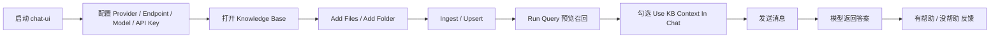
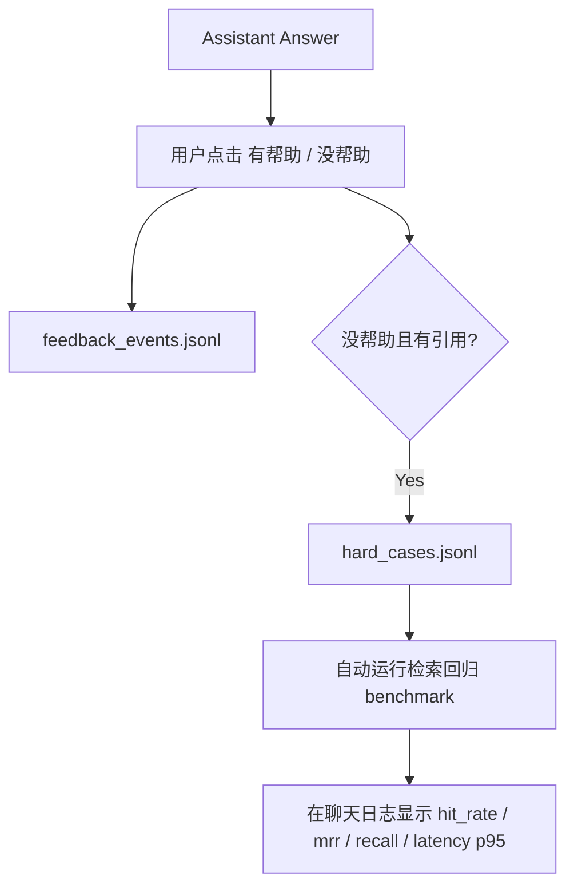

# GUI 指南

[English](gui.md) | 简体中文

YFanRAG 自带一个 Tkinter 图形界面，用于连接真实大模型 API，并把本地知识库检索结果注入对话上下文。

## 启动方式

```powershell
yfanrag chat-ui
```

或：

```powershell
python examples/04_tk_chat_app.py
```

## GUI 工作流



## 支持的 Provider

| Provider | 协议 |
| --- | --- |
| `openai_compatible` | `/v1/chat/completions` 及兼容实现 |
| `deepseek` | OpenAI-Compatible |
| `openai_responses` | `/v1/responses` |
| `anthropic` | `/v1/messages` |

## 页面结构

- 顶栏：`Knowledge Base` 按钮、`Stream` 开关、状态指示
- 左侧配置栏：`provider / endpoint / model / api_key / header / system prompt / extra headers / extra body`
- 右侧会话区：Markdown 渲染的消息记录、输入框、`Send`、`Stop`

## 快速上手

1. 选择 Provider 预设，推荐先从 `OpenAI-Compatible` 或 `DeepSeek` 开始。
2. 填写 `Endpoint / Model / API Key`。
3. 在输入框里提问，按 `Ctrl+Enter` 或点击 `Send`。
4. 需要流式输出时打开 `Stream`，中断时点击 `Stop`。

## API 配置持久化

- 启动时自动读取本地加密配置
- 退出时自动保存当前 API 配置
- 也可以手动点击 `Save API Config` / `Reload API Config`
- 默认路径：`~/.yfanrag/chat_api_config.enc.json`

## 知识库管理窗口

### 常规操作

1. 选择 `Database`、`Store`、`Chunker`、`Chunk Size/Overlap`、`Embedding Dims`
2. 点击 `Add Files` 或 `Add Folder`
3. 点击 `Ingest / Upsert`
4. 用 `Refresh Stats` 和 `List Doc IDs` 查看状态
5. 在 `KB Query` 执行 `auto / vector / hybrid / fts` 检索预览
6. 在 `Delete Doc ID(s)` 输入一个或多个 `doc_id` 并删除

### 结构化分块

- `.md`：按标题层级切分
- `.py`：按 `class / def / async def` 切分
- `.js/.jsx/.ts/.tsx/.mjs/.cjs`：按 `class / function / arrow function` 切分
- 超长段落会自动二次递归切块

### 自适应检索路由

- GUI 默认 `Query Mode = auto`
- 关键词/路径/报错定位倾向：优先 `fts`
- 语义问答倾向：优先 `vector`
- 混合场景：走 `hybrid` 并动态调整 `alpha / vector_top_k / fts_top_k`
- 当 FTS 不可用时自动回退到 `vector`

### Multi-Query + RRF + Reranker

- 每次检索会扩展为 `3-5` 个子查询
- 子查询独立召回后做 `RRF`
- 然后执行二阶段重排
- 默认候选深度为 `Top50`

## 反馈闭环



默认反馈文件：

- `~/.yfanrag/feedback/feedback_events.jsonl`
- `~/.yfanrag/feedback/hard_cases.jsonl`

## FAQ

- 下拉框文字看不清：更新到最新代码后重启 `yfanrag chat-ui`
- 非全屏看不到输入框：增大窗口高度后重启
- 检索无结果：先确认知识库中 `docs/chunks > 0`，再确认已勾选 `Use KB Context In Chat`

## 进一步阅读

- [快速开始](getting-started.zh-CN.md)
- [架构设计](architecture.zh-CN.md)
- [性能测试](performance.zh-CN.md)
